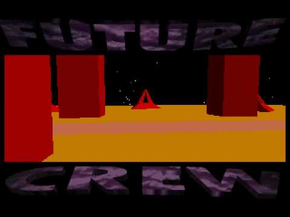

# Chapter 1. Introduction

## What You’ll Learn in This Chapter
* What the graphics pipeline is and how OpenGL relates to it.
* The origins of OpenGL and how it came to be the way that it is today.
* Some of the fundamental concepts that we’ll be building on throughout the repository.

This repository is about OpenGL. OpenGL is an interface that your application can use to access and control the graphics subsystem of the device on which it runs. This could be anything from a high-end graphics workstation, to a commodity desktop computer, to a video game console, to a mobile phone. Standardizing the interface to a subsystem increases portability and allows software developers to concentrate on creating quality products, producing interesting content, and ensuring the overall performance of their applications, rather than worrying about the specifics of the platforms they want them to run on. These standard interfaces are called application programming interfaces (APIs), of which OpenGL is one. This chapter introduces OpenGL, describes how it relates to the underlying graphics subsystem, and provides some history on the origin and evolution of OpenGL.

## OpenGL and the Graphics Pipeline
Generating a product at high efficiency and volume generally requires two things: scalability and parallelism. In factories, this is achieved by using production lines. While one worker installs the engine in a car, another can be installing the doors, and yet another can be installing the wheels. By overlapping the phases of production of the product, with each phase being executed by a skilled technician who concentrates his or her energy on that single task, each phase becomes more efficient and overall productivity goes up. Also, by making many cars at the same time, a factory can have multiple workers installing multiple engines or wheels or doors and many cars can be on the production line at the same time, each at a different stage of completion.

The same is true in computer graphics. The commands from your program are taken by OpenGL and sent to the underlying graphics hardware, which works on them in an efficient manner to produce the desired result as quickly and efficiently as possible. There could be many commands lined up to execute on the hardware (a status referred to as in flight), and some may even be partially completed. This allows their execution to be overlapped such that a later stage of one command might run concurrently with an earlier stage of another command. Futhermore, computer graphics generally consists of many repititions of very similar tasks (such as figuring out what color a pixel should be), and these tasks are usually indpendent of one another—that is, the result of coloring one pixel doesn’t depend on any other. Just as a car plant can build multiple cars simultaneously, so OpenGL can break up the work you give it and work on its fundamental elements in parallel. Through a combination of pipelining and parallelism, incredible performance of modern graphics processors is realized.

The goal of OpenGL is to provide an abstraction layer between your application and the underlying graphics subsystem, which is often a hardware accelerator made up of one or more custom, high-performance processors with dedicated memory, display outputs, and so on. This abstraction layer allows your application to not need to know who made the graphics processor (or graphics processing unit [GPU]), how it works, or how well it performs. Certainly it is possible to determine this information, but the point is that applications don’t need to.

As a design principle, OpenGL must strike a balance between too high and too low an abstraction level. On the one hand, it must hide differences between various manufacturers’ products (or between the various products of a single manufacturer) and system-specific traits such as screen resolution, processor architecture, installed operating system, and so on. On the other hand, the level of abstraction must be low enough that programmers can gain access to the underlying hardware and make best use of it. If OpenGL presented too high of an abstraction level, then it would be easy to create programs that fit the model, but very hard to use advanced features of the graphics hardware that weren’t included. This is the type of model followed by software such as game engines—new features of the graphics hardware generally require relatively large changes in the engine for games built on top of it to gain access to them. If the abstraction level is too low, applications need to start worrying about architectural peculiarities of the system they’re running on. Low levels of abstraction are common in video game consoles, for example, but don’t fit well into a graphics library that must support devices ranging from mobile phones to gaming PCs to high- powered professional graphics workstations.

As technology advances, more and more research is being conducted in computer graphics, best practices are being developed, and bottlenecks and requirements are moving—and so OpenGL must also move to keep up.

The current state of the art in graphics processing units, on which most OpenGL implementations are based, is capable of many teraflops of computing power, has gigabytes of memory that can be accessed at hundreds of gigabytes per second, and can drive multiple, multi-megapixel displays at high refresh rates. GPUs are also extremely flexible, and are able to work on tasks that might not be considered graphics at all, such as physical simulations, artificial intelligence, and even audio processing.

Current GPUs consist of large numbers of small programmable processors called shader cores that run mini-programs called shaders. Each core has a relatively low throughput, processing a single instruction of the shader in one or more clock cycles and normally lacking advanced features such as out-of-order execution, branch prediction, super-scalar issues, and so on. However, each GPU might contain anywhere from a few tens to a few thousands of these cores, and together they can perform an immense amount of work. The graphics system is broken into a number of stages, each represented either by a shader or by a fixed-function, possibly configurable processing block. Figure 1.1 shows a simplified schematic of the graphics pipeline.

In Figure 1.1, the boxes with rounded corners are considered fixed-function stages, whereas the boxes with square corners are programmable, which means that they execute shaders that you supply. In practice, some or all of the fixed-function stages may really be implemented in shader code, too—it’s just that you don’t supply that code, but rather the GPU manufacturer generally supplies it as part of a driver, firmware, or other system software.

## The Origins and Evolution of OpenGL
OpenGL has its origins at Silicon Graphics Inc. (SGI) and its IRIS GL. GL stood for (and still stands for) “graphics library,” and in much of the modern OpenGL documentation you will see the term “the GL,” meaning “the graphics library,” originating from this era. Silicon Graphics was a manufacturer of high-end graphics workstations (Silicon Graphics, or more accurately SGI, still exists today, but went bankrupt in 2009. Its assets and brands were acquired by Rackable Systems, which assumed the moniker SGI but does not operate in the high-end graphics market.). These were extremely expensive, and using a proprietary API for graphics wasn’t helping. Other manufacturers were producing much more inexpensive solutions running on competing APIs that were often compatible with each other. In the early 1990s, SGI realized that portability was important and so decided to clean up IRIS GL, remove system-specific parts of the API, and release it as an open standard that could be implemented, royalty free, by anyone. The very first version of OpenGL was released in June 1992 and was marked as OpenGL 1.0.

market. That year, SGI was also instrumental in establishing the OpenGL Architectural Review Board (ARB), the original members of which included companies such as Compaq, DEC, IBM, Intel, and Microsoft. Soon, other companies such as Hewlett-Packard, Sun Microsystems, Evans & Sutherland, and Intergraph joined the group. The OpenGL ARB is the standards body that designs, governs, and produces the OpenGL specification and is now a part of Khronos Group, which is a larger consortium of companies that oversees the development of many open standards. Some of these original members either no longer exist (perhaps having gone out of business or having been acquired by or merged with other companies) or are no longer members of the ARB, having left the graphics business or otherwise gone their own way. However, some still exist, either under new names or as the entity that was involved in the development of that very first version of OpenGL more than 20 years ago.

At time of writing, there have been 19 editions of the OpenGL specification. Their version numbers and time of publication are shown in Table 1.1. This repository covers version 4.5 of the OpenGL specification, and most of the samples in it require up-to-date drivers and hardware to run.

## Core Profile OpenGL
Twenty years is a long time in the development of cutting-edge technology. In 1992, the top-of-the-line Intel CPU was the 80486, math coprocessors were still optional, and the Pentium had not yet been invented (or at least released). Apple computers were still using Motorola 68K-derived processors and the PowerPC processors to which they would later switch would be made available during the second half of 1992. High- performance graphics acceleration was simply not something that was common in commodity home computers. If you didn’t have access to a high-performance graphics workstation, you probably would have no hope of using OpenGL for anything. Software rendering ruled the world and the Future Crew’s “Unreal” demo won the Assembly ’92 demo party. The best you could hope for in a home computer was some basic filled polygons or sprite rendering capabilities. The state of the art in 1992 home computer 3D graphics is shown in Figure 1.2.

Over time, the price of graphics hardware came down, performance went up, and— partly due to low-cost acceleration add-in boards for PCs, and partly due to the increased performance of video game consoles—new features and capabilities showed up in affordable graphics processors and were added to OpenGL. Most of these features originated in extensions proposed by members of the OpenGL ARB. Some interacted well with each other and with existing features in OpenGL, and some did not. Also, as newer, better ways of squeezing performance out of graphics systems were invented, they were simply added to OpenGL, resulting in it having multiple ways of doing the same thing.

For many years, the ARB held a strong position on backward compatibility, as it still does today. However, this backward compatibility comes at a significant cost. Best practices have changed—what may have worked well or was not really a significant bottleneck on mid-1990s graphics hardware doesn’t always fit modern graphics processor architecture well. Specifying how new features interact with the older legacy features isn’t easy and, in many cases, can make it almost impossible to cleanly introduce a new feature to OpenGL. As for implementing OpenGL, this has become such a difficult task that drivers tend to have more bugs than they really should and graphics vendors need to spend considerable amounts of energy maintaining support for all kinds of legacy features that don’t contribute to the advancement of or innovation in graphics.

For these reasons, in 2008, the ARB decided it would “fork” the OpenGL specification into two profiles. The first is the modern, core profile, which removes a number of legacy features, leaving only those that are truly accelerated by current graphics hardware. This specification is several hundred pages shorter (The core profile specification is still pretty hefty at more than 800 pages long.) than the other version of the specification, the compatibility profile. The compatibility profile maintains backward compatibility with all revisions of OpenGL back to version 1.0. As a consequence, software written in 1992 should compile and run on a modern graphics card with a thousand times greater performance today than when that program was first produced.

The compatibility profile really exists to allow software developers to maintain legacy applications and to add features to them without having to tear out years of work to shift to a new API. However, the core profile is strongly recommended by most OpenGL experts as the profile that should be used for new application development. In particular, on some platforms, newer features are available only if you are using the core profile of OpenGL; on others, an application written using the core profile of OpenGL will run faster than that same application unmodified, except to request the compatibility profile, even if it uses only features that are available in core profile OpenGL. Finally, if a feature is in the compatibility profile but has been removed from the core profile of OpenGL, there’s probably a good reason for that—and it’s a reasonable indication that you shouldn’t be using it. This repository covers only the core profile of OpenGL; this is the last time we will mention the compatibility profile.

## Primitives, Pipelines, and Pixels
As discussed, the model followed by OpenGL is that of a production line, or pipeline. Data flow within this model is generally one way, with data formed from commands called by your programs entering the front of the pipeline and flowing from stage to stage until it reaches the end of the pipeline. Along the way, shaders or other fixed- function blocks within the pipeline may pick up more data from buffers or textures, which are structures designed to store information that will be used during rendering. Some stages in the pipeline may even save data into these buffers or textures, allowing the application to read or save the data, or even permitting feedback to occur.

The fundamental unit of rendering in OpenGL is known as the primitive. OpenGL supports many types of primitives, but the three basic renderable primitive types are points, lines, and triangles. Everything you see rendered on the screen is a collection of (perhaps cleverly colored) points, lines, and triangles. Applications will normally break complex surfaces into a very large number of triangles and send them to OpenGL, where they are rendered using a hardware accelerator called a rasterizer. Triangles are, relatively speaking, pretty easy to draw. As polygons, triangles are always convex, so filling rules are easy to devise and follow. Concave polygons can always be broken down into two or more triangles, so hardware natively supports rendering triangles directly and relies on other subsystems (Sometimes these subsystems are more hardware modules, and sometimes they are functions of drivers implemented in software) to break complex geometry into triangles. The rasterizer is dedicated hardware that converts the three-dimensional representation of a triangle into a series of pixels that need to be drawn onto the screen.

Points, lines, and triangles are formed from collections of one, two, or three vertices, respectively. A vertex is simply a point within a coordinate space. In our case, we primarily consider a three-dimensional coordinate system. The graphics pipeline is broken down into two major parts. The first part, often known as the front end, processes vertices and primitives, eventually forming them into the points, lines, and triangles that will be handed off to the rasterizer. This is known as primitive assembly. After going through the rasterizer, the geometry has been converted from what is essentially a vector representation into a large number of independent pixels. These are handed off to the back end, which includes depth and stencil testing, fragment shading, blending, and updating of the output image.

As you progress through this repository, you will see how to tell OpenGL to start working for you. We’ll go over how to create buffers and textures and hook them up to your programs. We’ll also see how to write shaders to process your data and how to configure the fixed-function blocks of OpenGL to do what you want. OpenGL is really a large collection of fairly simple concepts, built upon each other. Having a good foundation and a big-picture view of the system is essential, and over the next few chapters, we hope to provide that to you.

###### Proceed to read the source codes from source1.cpp on and follow the numbered comments in the source files.

## Summary
In this chapter you’ve been introduced to OpenGL and have read a little about its origins, history, status, and direction. You have seen the OpenGL pipeline and have been told how this repository will progress. We have mentioned some of the terminology that we’ll be using throughout the repository. Over the next few chapters, you’ll create your first OpenGL program, dig a little deeper into the various stages of the OpenGL pipeline, and then lay some foundations with some of the math that’s useful in the world of computer graphics.
